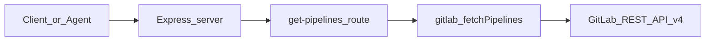

# GitLab pipeline MCP-demo HTTP service — team overview

## 1. Executive summary

This repo contains a small **Node.js Express** service ([`server.js`](../server.js)) that exposes HTTP endpoints labeled as “MCP tools,” starting with **GitLab pipeline listing** for a given project ID. It demonstrates **secure GitLab API access** via a Personal Access Token and a stable JSON API for agents or internal tooling so callers do not embed GitLab URLs and secrets everywhere. Current scope: **GET** `/tools/get-pipelines?projectId=<id>` backed by [`gitlab.js`](../gitlab.js), which calls `GET /projects/:id/pipelines` on GitLab.

---

## 2. Overview

### Purpose

Provide a thin HTTP layer over the GitLab REST API so tools (including MCP clients or scripts) do not embed GitLab URLs and tokens in every caller.

### Tech stack

| Layer | Choice |
|------|--------|
| Runtime | Node.js (ES modules; [`package.json`](../package.json) `"type": "module"`) |
| HTTP | Express 5 |
| HTTP client | Axios |
| Configuration | dotenv v17 ([`server.js`](../server.js): `dotenv.config({ override: true })`) |
| External API | GitLab.com (or self-hosted) REST API v4 |

### Configuration (no secrets in repo)

- **`GITLAB_BASE_URL`** — e.g. `https://gitlab.com/api/v4`
- **`GITLAB_TOKEN`** — Personal Access Token with at least **`read_api`** (pipelines)

Copy [`.env.example`](../.env.example) to `.env` and fill in values. `.env` is gitignored.

### High-level architecture

---

## 3. Workflow

### A. Local setup

1. Clone the repo; run `npm install`.
2. Create `.env` from `.env.example`; never commit real tokens.
3. Generate a GitLab PAT: **User Settings → Access Tokens** → scope **`read_api`** (minimum for this demo).
4. Start the server: `node server.js` (default port **3000**; override with **`PORT`** if needed).

### B. Request/response workflow

1. Client calls: `GET http://localhost:3000/tools/get-pipelines?projectId=<numeric_project_id>`
2. The server validates `projectId` and calls `fetchPipelines(projectId)` in [`gitlab.js`](../gitlab.js).
3. Axios requests `{GITLAB_BASE_URL}/projects/{projectId}/pipelines` with header `PRIVATE-TOKEN: {GITLAB_TOKEN}`.
4. **Success**
   - With pipelines: JSON includes `success`, `count`, and `pipelines` (up to the **5** most recent).
   - Empty list: `success: true`, `count: 0`, `pipelines: []`, and `message: "No pipelines found"`.
   - Missing `projectId` → **400** with `success: false` and `error: "projectId is required"`.
   - Upstream/GitLab or other failures → **500** with `success: false` and `error: "Failed to fetch pipelines"` (details are logged server-side; see “Cons”).

### C. Operational notes for the team

- **Restart after changing `.env`**: Node loads environment variables at process start; edits require a restart.
- **`dotenv.config({ override: true })`**: ensures `.env` wins over a stale `GITLAB_TOKEN` already exported in the shell—a common pitfall with dotenv v17 behavior.

---

## 4. Feedback: pros and cons

### Pros

- **Small surface area** — easy to read; extend with more GitLab endpoints in [`gitlab.js`](../gitlab.js).
- **Standard stack** — Express + Axios; no exotic dependencies.
- **Clear separation** — routing in [`server.js`](../server.js); GitLab calls isolated in [`gitlab.js`](../gitlab.js).
- **Explicit env contract** — base URL + token documented for GitLab.com vs self-hosted.

### Cons / risks

- **Not true MCP over stdio** — this is an HTTP server with MCP-*style* tool paths. Cursor and other MCP clients often expect the MCP protocol (stdio/SSE), not raw REST. Clarify whether the next step is a full MCP SDK server or this HTTP proxy remains the integration layer.
- **Error detail** — the route returns a generic `"Failed to fetch pipelines"` on failure; operators must read server logs for GitLab status/body (good for security, harder for API consumers).
- **Secrets** — the PAT in `.env` must stay out of git, logs, and screenshots; rotate if leaked.
- **Debug / telemetry** — avoid session-specific debug calls (e.g. to local ingest URLs) in shared deployments; **remove or gate behind `NODE_ENV !== 'production'`** before production.

---

## 5. Do's and don'ts

### Do

- **Use `.env` for secrets** — Copy [`.env.example`](../.env.example) to `.env`; keep `.env` out of version control (see [`.gitignore`](../.gitignore)).
- **Grant least privilege on the PAT** — Use **`read_api`** (or narrower scopes if GitLab allows for your use case); avoid `api` / write scopes unless you add mutating endpoints.
- **Restart the server after editing `.env`** — Environment variables load once at process start.
- **Prefer numeric project IDs** — GitLab’s REST API expects the numeric **project ID**, not only `namespace/project` path, unless you encode the path API elsewhere.
- **Verify GitLab connectivity with curl** — Test `GET /api/v4/user` or `/projects/:id/pipelines` with the same token before debugging the Node service.
- **Treat shell `GITLAB_TOKEN` as override-sensitive** — This service uses `dotenv.config({ override: true })` so `.env` wins over exported shell variables; if behavior is confusing, run `unset GITLAB_TOKEN` or rely on `.env` only.

### Don't

- **Commit tokens or paste them into tickets, screenshots, or chat** — Rotate immediately if exposed.
- **Run production traffic against localhost without hardening** — Add authentication, TLS, and rate limiting before exposing beyond trusted networks.
- **Assume this HTTP API is the MCP protocol** — MCP clients typically expect stdio/SSE MCP transports; this repo is an HTTP shim with MCP-*style* paths unless you add a real MCP server layer.
- **Log full request headers in shared logs** — `PRIVATE-TOKEN` must never appear in application logs or APM payloads.
- **Share one long-lived PAT across many people** — Prefer per-user or per-service tokens with rotation.

---

## 6. Recommendations / next steps

- **Done in repo**: [`.env.example`](../.env.example), `.gitignore` for `.env`.
- **Troubleshooting** (quick reference):

  | Symptom | Likely cause |
  |--------|----------------|
  | **401** | Invalid token or missing **`read_api`** scope |
  | **404** | Wrong numeric **project ID** (not path); or project not visible to the token’s user |
  | **Empty pipelines** | No pipelines have run yet, or project ID / visibility issue |

- Add structured logging if the team needs auditability.
- If the goal is **Cursor MCP**: evaluate `@modelcontextprotocol/sdk` (or an official GitLab MCP if available) and align transport with your agent clients.

---

## 7. Document maintenance

This overview matches the code in [`server.js`](../server.js) and [`gitlab.js`](../gitlab.js). Update this file when routes, env vars, or response shapes change.
