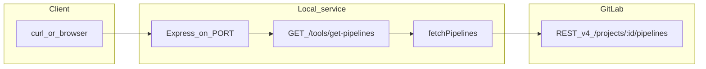

# MCP server demo — processes and workflow

This document describes what is implemented in this repository, how data flows from a client to GitLab, and the commands you use to run and verify the service.

For a longer team-oriented overview (pros/cons, do’s and don’ts, troubleshooting), see [`gitlab-mcp-demo-overview.md`](gitlab-mcp-demo-overview.md).

---

## 1. What this project is

A small **Node.js** HTTP server ([`server.js`](../server.js)) that exposes routes named like **MCP tools**. Today it implements **listing GitLab CI/CD pipelines** for a numeric project ID by calling the GitLab REST API ([`gitlab.js`](../gitlab.js)).

This is **not** the full Model Context Protocol transport (stdio/SSE). It is an **Express** app with JSON endpoints that agents or scripts can call over HTTP.

---

## 2. Implemented pieces

| Piece | Role |
|--------|------|
| [`server.js`](../server.js) | Express app: health route, `/tools/get-pipelines`, loads `.env` with `dotenv.config({ override: true })` |
| [`gitlab.js`](../gitlab.js) | `fetchPipelines(projectId)` — `GET {GITLAB_BASE_URL}/projects/{id}/pipelines` with `PRIVATE-TOKEN` |
| [`.env.example`](../.env.example) | Template for `GITLAB_BASE_URL`, `GITLAB_TOKEN`, `PORT` |
| [`package.json`](../package.json) | Dependencies: `express`, `axios`, `dotenv`; ES modules (`"type": "module"`) |

**Environment variables**

- `GITLAB_BASE_URL` — API root (default in example: `https://gitlab.com/api/v4`)
- `GITLAB_TOKEN` — GitLab Personal Access Token (scope **read_api** is enough for pipelines)
- `PORT` — optional; server defaults to **3000**

**Why `override: true`**

Values in `.env` override a `GITLAB_TOKEN` already exported in your shell, so the file you edit is the one the process uses after restart.

---

## 3. End-to-end workflow



1. You start the Node process; it reads `.env` and listens on `PORT` (default 3000).
2. A client requests `GET /tools/get-pipelines?projectId=<numeric_id>`.
3. The handler calls `fetchPipelines(projectId)`.
4. Axios sends an authenticated request to GitLab; JSON pipeline objects are returned.
5. The handler responds with `success`, `count`, and up to **five** pipelines (or an empty success payload).

---

## 4. Commands (copy/paste)

Paths assume you are in the repository root (`mcp-server-demo`).

### Install dependencies

```bash
npm install
```

### Configure secrets

```bash
cp .env.example .env
```

Edit `.env`: set `GITLAB_TOKEN` (and adjust `GITLAB_BASE_URL` / `PORT` if needed). Do not commit `.env` (it is listed in [`.gitignore`](../.gitignore)).

### Run the server

```bash
node server.js
```

Expected console output includes a line like: server running on `http://localhost:3000` (or your `PORT`).

### Call the implemented tool (local)

Replace `YOUR_PROJECT_ID` with the GitLab numeric project ID.

```bash
curl "http://localhost:3000/tools/get-pipelines?projectId=YOUR_PROJECT_ID"
```

### Sanity-check GitLab directly (bypasses this app)

Use the same token as in `.env` to confirm the token and project ID (optional debugging).

```bash
curl --header "PRIVATE-TOKEN: $GITLAB_TOKEN" \
  "https://gitlab.com/api/v4/user"
```

```bash
curl --header "PRIVATE-TOKEN: $GITLAB_TOKEN" \
  "https://gitlab.com/api/v4/projects/YOUR_PROJECT_ID/pipelines"
```

If these fail with 401, fix the token or scopes before debugging the Node server.

### Root health check

```bash
curl "http://localhost:3000/"
```

---

## 5. HTTP API reference (implemented)

### `GET /`

- **Response:** Plain text — confirms the process is up.

### `GET /tools/get-pipelines?projectId=<id>`

- **Query:** `projectId` — required; GitLab numeric project ID (string in query is fine).
- **Success (has pipelines):** JSON with `success: true`, `count`, `pipelines` (array, capped at 5 items).
- **Success (no pipelines):** `success: true`, `count: 0`, `message: "No pipelines found"`, `pipelines: []`.
- **Client error:** HTTP **400** if `projectId` is missing.
- **Server/upstream error:** HTTP **500** with `{ "success": false, "error": "Failed to fetch pipelines" }`; details are logged on the server stdout/stderr (GitLab status and body).

---

## 6. Operational checklist

- Restart **node** after any change to `.env`.
- Prefer keeping the token only in `.env` for this demo; avoid exporting a conflicting `GITLAB_TOKEN` in the shell, or rely on `override: true` as configured.
- For production or shared networks, this demo would still need authentication on the HTTP layer, TLS, and hardening — not included here.

---

## 7. Related documentation

| Document | Contents |
|----------|----------|
| [`gitlab-mcp-demo-overview.md`](gitlab-mcp-demo-overview.md) | Team overview, architecture, pros/cons, do’s and don’ts, troubleshooting |
| [`team_gitlab_mcp_doc_159f5b1f.plan.md`](team_gitlab_mcp_doc_159f5b1f.plan.md) | Original planning notes for the GitLab MCP-style doc work |
