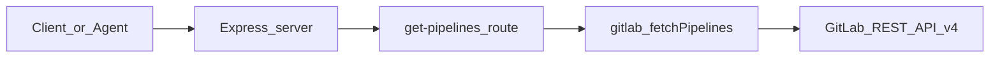

# Team documentation plan: GitLab pipeline MCP-style HTTP service

## Deliverable

One markdown document (suggested filename: [`docs/gitlab-mcp-demo-overview.md`](docs/gitlab-mcp-demo-overview.md)) or equivalent wiki page. Structure below is copy-paste ready for your team.

---

## 1. Executive summary (2–4 sentences)

- What it is: a small **Node.js Express** service ([`server.js`](../server.js)) that exposes HTTP endpoints labeled as “MCP tools,” starting with **GitLab pipeline listing** for a given project ID.
- Why it matters: demonstrates **secure GitLab API access** via Personal Access Token and a stable JSON API for agents or internal tooling.
- Current scope: **GET** `/tools/get-pipelines?projectId=<id>` backed by [`gitlab.js`](../gitlab.js) calling `GET /projects/:id/pipelines` on GitLab.

---

## 2. Overview

**Purpose**

- Provide a thin HTTP layer over the GitLab REST API so tools (including MCP clients or scripts) do not embed GitLab URLs and tokens in every caller.

**Tech stack**

| Layer | Choice |
|------|--------|
| Runtime | Node.js (ES modules, [`package.json`](../package.json) `"type": "module"`) |
| HTTP | Express 5 |
| HTTP client | Axios |
| Configuration | dotenv v17 ([`server.js`](../server.js) `dotenv.config({ override: true })`) |
| External API | GitLab.com (or self-hosted) REST API v4 |

**Configuration (no secrets in repo)**

- `GITLAB_BASE_URL` — e.g. `https://gitlab.com/api/v4`
- `GITLAB_TOKEN` — Personal Access Token with at least **`read_api`** (pipelines)

**High-level architecture**



---

## 3. Workflow

**A. Local setup**

1. Clone repo; run `npm install`.
2. Create `.env` from team template (see below); never commit real tokens.
3. Generate a GitLab PAT: User Settings → Access Tokens → scope **`read_api`** (minimum for this demo).
4. Start server: `node server.js` (default port **3000**, override with `PORT` if needed).

**Suggested `.env.example` (for the doc; add to repo without real values)**

```env
GITLAB_BASE_URL=https://gitlab.com/api/v4
GITLAB_TOKEN=
PORT=3000
```

**B. Request/response workflow**

1. Client calls: `GET http://localhost:3000/tools/get-pipelines?projectId=<numeric_project_id>`
2. Server validates `projectId`; calls `fetchPipelines(projectId)` in [`gitlab.js`](../gitlab.js).
3. Axios requests: `{GITLAB_BASE_URL}/projects/{projectId}/pipelines` with header `PRIVATE-TOKEN: {GITLAB_TOKEN}`.
4. Success JSON shape (conceptually): `{ success, count, pipelines: [... up to 5 ...] }`; empty list returns success with `count: 0`; missing `projectId` → 400; upstream/GitLab errors → 500 with generic message (see “Cons”).

**C. Operational notes for the team**

- **Restart after changing `.env`**: Node loads env at process start; edits require restart.
- **`dotenv.config({ override: true })`**: ensures `.env` wins over a stale `GITLAB_TOKEN` already exported in the shell—a common pitfall with dotenv v17 behavior.

---

## 4. Feedback: pros and cons

**Pros**

- **Small surface area** — easy to read, extend with more GitLab endpoints in [`gitlab.js`](../gitlab.js).
- **Standard stack** — Express + Axios; no exotic dependencies.
- **Clear separation** — routing in [`server.js`](../server.js), GitLab calls isolated in [`gitlab.js`](../gitlab.js).
- **Explicit env contract** — base URL + token documented for different environments (GitLab.com vs self-hosted).

**Cons / risks**

- **Not true MCP over stdio** — this is an HTTP server with MCP-*style* tool paths; integrating with Cursor’s MCP often expects the MCP protocol (stdio/SSE), not raw REST. Clarify with the team whether the next step is a full MCP SDK server or this HTTP proxy remains the integration layer.
- **Error detail** — route returns a generic `"Failed to fetch pipelines"` on failure; operators must read server logs for GitLab’s status/body (good for security, harder for API consumers).
- **Secrets** — PAT in `.env` must stay out of git, logs, and screenshots; rotate if leaked.
- **Debug instrumentation** — current [`server.js`](../server.js) / [`gitlab.js`](../gitlab.js) still contain **session-specific debug `fetch` calls** to a local ingest URL; **remove or gate behind `NODE_ENV !== 'production'`** before any shared or production deployment.

---

## 5. Recommendations / next steps (optional section for the doc)

- Add `.env.example`, `.gitignore` for `.env`, and a short **Troubleshooting** table (401 → token/scope; 404 → project ID; empty pipelines → none ran yet).
- Remove or feature-flag debug logging; add structured logging if the team needs auditability.
- If the goal is **Cursor MCP**: evaluate `@modelcontextprotocol/sdk` (or official GitLab MCP if available) and align transport with your agent clients.

---

## Implementation note (after you approve Plan mode)

This plan only defines **content and structure**. Once you exit Plan mode, the same text can be written into [`docs/gitlab-mcp-demo-overview.md`](docs/gitlab-mcp-demo-overview.md) (or your preferred path) and debug blocks cleaned up in code per your release policy.
